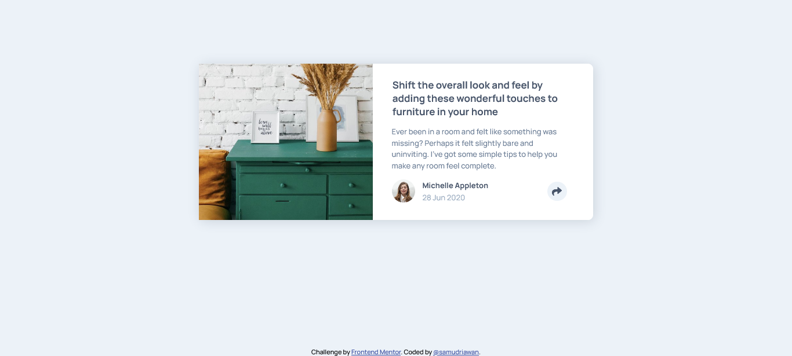

# Frontend Mentor - Article preview component solution

This is a solution to the [Article preview component challenge on Frontend Mentor](https://www.frontendmentor.io/challenges/article-preview-component-dYBN_pYFT). Frontend Mentor challenges help you improve your coding skills by building realistic projects.

## Table of contents

- [Overview](#overview)
  - [Screenshot](#screenshot)
  - [The challenge](#the-challenge)
  - [Links](#links)
- [My process](#my-process)
  - [Built with](#built-with)
  - [What I learned](#what-i-learned)
- [Contact](#contact)

## Overview

### Screenshot

### The challenge

Users should be able to:

- View the optimal layout for the component depending on their device's screen size
- See the social media share links when they click the share icon

### Links

[Solution URL]() |
[Live Site URL](https://samudriawan.github.io/article-preview-frontendmentor/) |
[Challenge](https://www.frontendmentor.io/challenges/article-preview-component-dYBN_pYFT)

## My process

### Built with

- Semantic HTML5 markup
- Flexbox
- Mobile-first workflow
- JavaScript
- [SASS](https://sass-lang.com/) - CSS Preprocessor

### What I learned

In this challenge to practice layout and position and get myself comfortable with SASS.

## Contact

- Github - [@samudriawan](https://github.com/samudriawan/)
- Twitter - [@samudriawan](https://twitter.com/samudriawan)
- Frontend Mentor - [@samudriawan](https://www.frontendmentor.io/profile/samudriawan)
